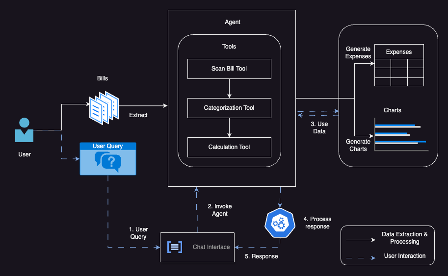

# Expense Manager: Exploring Pydantic, Tools, and Agents


This repository demonstrates how to build an intelligent **Expense Manager** using modern AI techniques. The Expense Manager processes bill images to extract, categorize, and summarize expenses, providing visualizations and enabling interactive queries. It leverages **Pydantic** for structured data handling, **LangChain Tools** for modular task execution, and **Agents** for dynamic orchestration.

---

## Features

- **Bill Processing**: Extracts expense details from bill images.
- **Categorization**: Assigns expenses to predefined categories like "Groceries" or "Transport."
- **Summarization**: Calculates total expenses for each category.
- **Interactive Querying**: Answer questions like "What is the highest expense category?" or "How much did I spend on Utilities?"
- **Data Validation**: Ensures structured, validated data at every step using Pydantic.
- **Visualization**: Generates category-wise expense charts.

---
## Workflow
Here’s a visual representation of the workflow:



---

## Usage

```python
from PIL import Image
from expense_manager import ExpenseManager  # Adjust the import based on your package structure

# List of paths to bill images to be processed
image_paths = ["bills/electricity_bill.jpg", "bills/other_bill.jpg", "bills/restaurant.jpg", "bills/ticket.jpg"]
images = [Image.open(image_path) for image_path in image_paths]

# Initialize the Expense Manager
expense_manager = ExpenseManager(image_paths)

# Outputs
print(expense_manager.categorized_expense_report)
print(expense_manager.category_expense_report)

# Query example
response = expense_manager.answer_user_query(query="What is the highest expense category?")
print(response)
```
## Key Components

### 1. Pydantic
Pydantic is used to define schemas for structured and validated data handling throughout the workflow.

### 2. LangChain Tools
Tools handle specific tasks such as scanning bills, categorizing expenses, and calculating summaries.

### 3. Agents
Agents dynamically orchestrate the tools and handle user queries intelligently.


